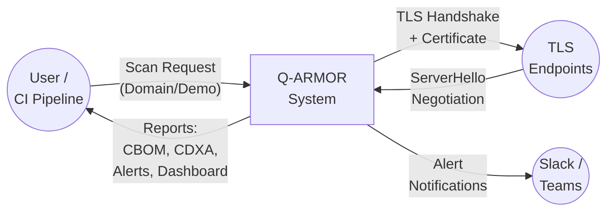
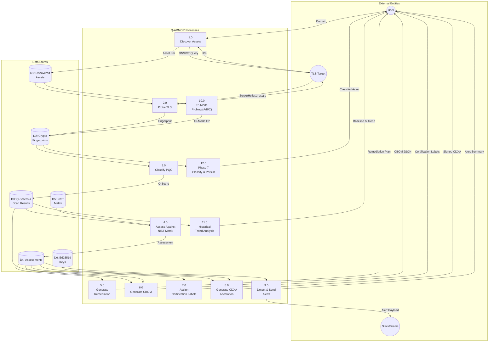
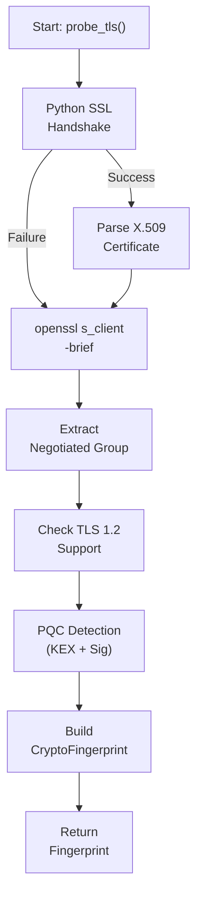
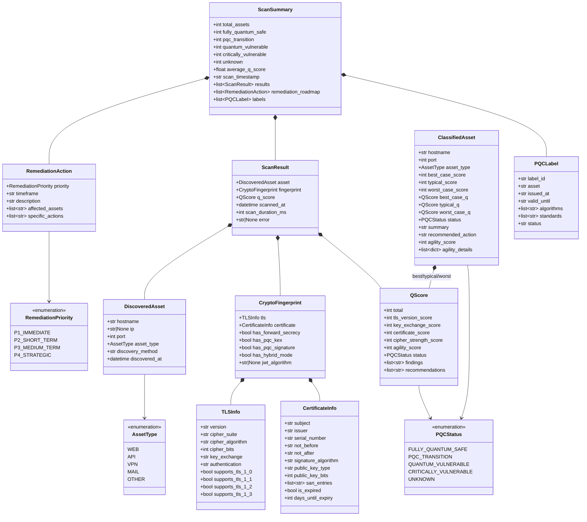
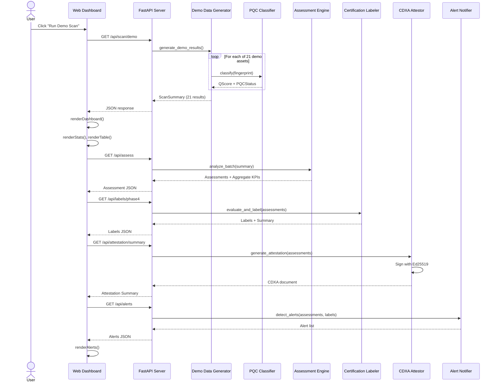
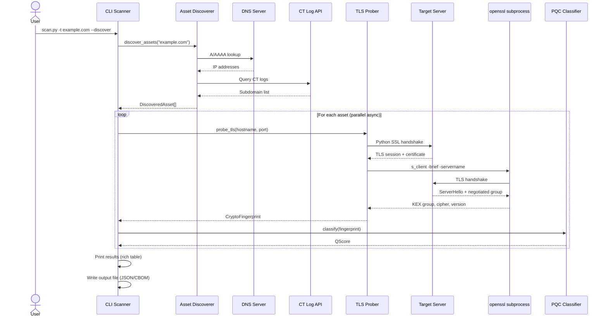
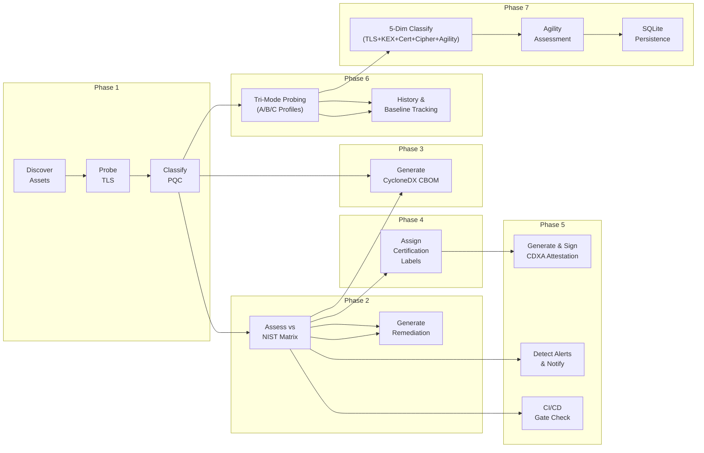

<div align="center">

# Q-ARMOR v9.0.0

### Quantum-Aware Mapping & Observation for Risk Remediation

**A production-quality Post-Quantum Cryptography (PQC) readiness scanner for internet-facing assets**

[](https://python.org)
[](https://fastapi.tiangolo.com)
[](https://csrc.nist.gov)
[](https://cyclonedx.org)
[](LICENSE)

</div>

---

## Table of Contents

- [1. Introduction](#1-introduction)
  - [1.1 Purpose](#11-purpose)
  - [1.2 Scope](#12-scope)
  - [1.3 Intended Audience](#13-intended-audience)
- [2. Overall Description](#2-overall-description)
  - [2.1 Product Perspective](#21-product-perspective)
  - [2.2 Product Functions](#22-product-functions)
  - [2.3 User Classes and Characteristics](#23-user-classes-and-characteristics)
  - [2.4 Operating Environment](#24-operating-environment)
  - [2.5 Design and Implementation Constraints](#25-design-and-implementation-constraints)
  - [2.6 Assumptions and Dependencies](#26-assumptions-and-dependencies)
- [3. Specific Requirements](#3-specific-requirements)
  - [3.1 Functional Requirements](#31-functional-requirements)
  - [3.2 External Interface Requirements](#32-external-interface-requirements)
  - [3.3 System Features](#33-system-features)
  - [3.4 Non-Functional Requirements](#34-non-functional-requirements)
- [Architecture & Diagrams](#architecture--diagrams)
  - [Enterprise-Wide Architecture](#enterprise-wide-architecture)
  - [Data Flow Diagrams (DFD)](#data-flow-diagrams-dfd)
  - [UML Class Diagram](#uml-class-diagram)
  - [UML Sequence Diagrams](#uml-sequence-diagrams)
  - [Workflow Diagram](#workflow-diagram)
  - [ASCII Workflow Flowchart](#ascii-workflow-flowchart)
- [Project Structure](#project-structure)
- [Quick Start](#quick-start)
- [API Reference](#api-reference)
- [CLI Reference](#cli-reference)
- [Testing](#testing)

---

## 1. Introduction

### 1.1 Purpose

Q-ARMOR is a **Post-Quantum Cryptography (PQC) readiness scanner** designed to discover, probe, classify, assess, and remediate the cryptographic posture of internet-facing assets. It evaluates endpoints against the **NIST FIPS 203 (ML-KEM), FIPS 204 (ML-DSA), and FIPS 205 (SLH-DSA)** post-quantum standards.

The purpose of this Software Requirements Specification (SRS) document is to provide a comprehensive description of the Q-ARMOR system, its architecture, functional and non-functional requirements, data flows, and design constraints.

### 1.2 Scope

Q-ARMOR covers the full lifecycle of **PQC compliance assessment**:

| Phase | Capability | Module(s) |
|-------|-----------|-----------|
| **Phase 1** | Asset Discovery & TLS Protocol Analysis | `discoverer.py`, `prober.py`, `classifier.py` |
| **Phase 2** | PQC Assessment & Remediation | `assessment.py`, `remediation.py`, `nist_matrix.py` |
| **Phase 3** | CycloneDX 1.6 CBOM Generation | `cbom_generator.py` |
| **Phase 4** | 3-Tier Certification Labeling Engine | `labeler.py` |
| **Phase 5** | Compliance-as-Code Attestation & Automation | `attestor.py`, `notifier.py` |
| **Phase 6** | Tri-Mode Probing & Asset Discovery Foundation | `discoverer.py`, `prober.py`, `demo_data.py` |
| **Phase 7** | PQC Classification + Agility Assessment + SQLite DB | `classifier.py`, `agility_assessor.py`, `database.py`, `nist_matrix.py` |
| **Phase 8** | Regression Detection + CycloneDX 1.7 CBOM | `regression_detector.py`, `cbom_generator.py` |
| **Phase 9** | PQC Labeling + Label Registry + FIPS Attestation | `labeler.py`, `label_registry.py`, `attestor.py` |

**In Scope:**
- TLS handshake analysis (via Python `ssl` + `openssl s_client`)
- PQC classification based on negotiated server parameters only
- Q-Score quantification (0-100)
- CycloneDX CBOM and CDXA document generation
- Digital signing of attestations (Ed25519)
- Alert detection and Slack/Teams webhook integration
- CI/CD build-breaking gate for quantum risk
- Web-based interactive dashboard
- CLI scanner with rich terminal output

**Out of Scope:**
- Active exploitation or penetration testing
- Certificate Authority (CA) operations
- Quantum key distribution (QKD) hardware
- Real-time network packet capture

### 1.3 Intended Audience

| Audience | Interest |
|----------|----------|
| **CISOs & Security Architects** | Enterprise PQC migration strategy and compliance reporting |
| **DevSecOps Engineers** | CI/CD integration, CBOM generation, automated alerting |
| **Compliance Officers** | NIST FIPS compliance attestation documents |
| **Network Administrators** | TLS configuration auditing and remediation guidance |
| **Developers** | API integration, extending the scanner |
| **Auditors** | Verifiable, signed compliance evidence (CDXA) |

---

## 2. Overall Description

### 2.1 Product Perspective

Q-ARMOR operates as a **standalone security assessment platform** with persistent storage, consisting of:

1. **Backend Server** — A FastAPI application providing 45+ RESTful API endpoints with SQLite persistence
2. **Web Dashboard** — A single-page application (SPA) served by the backend
3. **CLI Scanner** — A standalone command-line tool for batch scanning

```
                                    External Systems
                                    ┌───────────────┐
                                    │  Slack/Teams   │
                                    │  CI/CD Pipeline│
                                    │  Web Browser   │
                                    └───────┬───────┘
                                            │
    ┌───────────────────────────────────────┼────────────────────────────────────┐
    │                           Q-ARMOR System                                   │
    │                                                                            │
    │   ┌──────────┐    ┌──────────┐    ┌──────────────┐    ┌──────────────┐    │
    │   │  FastAPI  │    │   CLI    │    │  Frontend    │    │  Webhooks    │    │
    │   │  Server   │    │ Scanner  │    │  Dashboard   │    │  Notifier    │    │
    │   └────┬─────┘    └────┬─────┘    └──────────────┘    └──────────────┘    │
    │        │               │                                                   │
    │   ┌────┴───────────────┴──────────────────────────────────────────┐       │
    │   │                    Scanner Engine (v9.0.0)                     │       │
    │   │  Discoverer → Prober → Classifier → Assessor → Remediator    │       │
    │   │                ↓          ↓            ↓           ↓           │       │
    │   │            CBOM Gen    Labeler     Attestor     Notifier      │       │
    │   │                ↓          ↓            ↓                       │       │
    │   │         Regression   Registry     CDXA v2                     │       │
    │   │         Detector     (append)     (FIPS)                      │       │
    │   └──────────────────────────────────────────────────────────────┘       │
    │                                                                            │
    │   ┌──────────────────────┐    ┌──────────────┐    ┌──────────────────┐    │
    │   │  Target Servers      │    │ DNS/CT Logs  │    │  NIST Matrix DB  │    │
    │   │  (TLS Endpoints)     │    │ (Discovery)  │    │  (Reference)     │    │
    │   └──────────────────────┘    └──────────────┘    └──────────────────┘    │
    └───────────────────────────────────────────────────────────────────────────┘
```

### 2.2 Product Functions

| ID | Function | Description |
|----|----------|-------------|
| F1 | **Asset Discovery** | DNS resolution, subdomain enumeration via Certificate Transparency logs |
| F2 | **TLS Probing** | Full TLS handshake, certificate parsing, negotiated group extraction via `openssl s_client` |
| F3 | **PQC Classification** | Q-Score (0-100) with 4-component breakdown: TLS version, key exchange, certificate, cipher strength |
| F4 | **Status Assignment** | 5-tier: Fully Quantum Safe, PQC Transition, Quantum Vulnerable, Critically Vulnerable, Unknown |
| F5 | **NIST Assessment** | 4-dimension evaluation against FIPS 203/204 matrix (TLS, KEX, certificate, symmetric) |
| F6 | **Remediation** | Priority-tier (P1-P4) actionable recommendations with NIST/RFC references and timelines |
| F7 | **CBOM Export** | CycloneDX 1.6 Cryptographic Bill of Materials in JSON format |
| F8 | **Certification Labels** | 3-tier certification: Fully Quantum Safe / PQC Ready / Non-Compliant |
| F9 | **CDXA Attestation** | Ed25519-signed compliance attestation with NIST FIPS evidence claims |
| F10 | **Alert Detection** | HNDL vulnerability, HIGH quantum risk, non-compliance threshold, crypto downgrade alerts |
| F11 | **Webhook Notifications** | Slack and Microsoft Teams integration via incoming webhooks |
| F12 | **CI/CD Gate** | Build-breaking exit code when HIGH quantum risk endpoints are detected (`--ci` flag) |
| F13 | **Demo Mode** | 21 simulated bank assets covering all 5 PQC status categories |
| F14 | **Phase 7 Classification** | 5-dimension Q-Score (TLS 20 + KEX 30 + Cert 20 + Cipher 15 + Agility 15 = 100) with best/typical/worst tri-mode scoring |
| F15 | **Agility Assessment** | 5-indicator crypto-agility scoring: CDN, software currency, ACME CA, protocol flexibility, SAN diversity |
| F16 | **SQLite Persistence** | WAL-mode SQLite database with 4 tables: scans, asset_scores, labels, alerts — full CRUD + delta comparison |
| F17 | **Regression Detection** | Cross-scan comparison detecting new assets, score regressions (≥5 drop), and missed PQC upgrades |
| F18 | **CycloneDX 1.7 CBOM** | Enhanced CBOM with pqcAssessment extension, dependency graph, and regression-based vulnerabilities |
| F19 | **Phase 9 PQC Labeling** | Three-tier certification labels (Tier 1/2/3) from ClassifiedAsset with gap analysis and fix timelines |
| F20 | **Label Registry** | Append-only label log with auto-revoke on algorithm regression or certificate expiry |
| F21 | **FIPS Attestation v2** | CDXA v2 from LabelSummary + CBOM with per-standard FIPS 203/204/205 compliance claims |

### 2.3 User Classes and Characteristics

| User Class | Technical Level | Primary Interactions |
|-----------|----------------|---------------------|
| **Security Analyst** | Expert | CLI scanning, CBOM review, CDXA verification |
| **CISO / Manager** | Intermediate | Web dashboard, summary reports, compliance attestations |
| **DevOps Engineer** | Expert | CI/CD integration, API calls, webhook setup |
| **Compliance Auditor** | Low-Medium | Attestation download, label verification |
| **Network Admin** | High | Endpoint scanning, remediation execution |

### 2.4 Operating Environment

| Component | Requirement |
|-----------|------------|
| **Runtime** | Python 3.10+ |
| **OS** | macOS, Linux, Windows (WSL) |
| **External Binary** | `openssl` (for `s_client` ServerHello extraction) |
| **Network** | Outbound TCP 443 (or custom ports) to scan targets |
| **Browser** | Any modern browser (Chrome, Firefox, Safari, Edge) for the dashboard |
| **Memory** | Minimum 512 MB RAM for 20-endpoint scans |
| **Disk** | ~50 MB for application + dependencies; SQLite DB grows with scan history |

### 2.5 Design and Implementation Constraints

1. **No PQC False Positives** — PQC status is derived exclusively from the ServerHello negotiated group, never from client cipher offers
2. **Deterministic TLS Parsing** — Uses `openssl s_client` subprocess for key exchange group extraction since Python's `ssl` module does not expose this information
3. **UNKNOWN on Failure** — If TLS parsing fails or returns insufficient data, the status is marked `UNKNOWN`, never defaulting to a vulnerability assumption
4. **SNI Support** — All TLS probes include Server Name Indication (SNI) for virtual-hosted environments
5. **IPv4/IPv6 Dual-Stack** — Address resolution supports both IPv4 and IPv6 via `socket.getaddrinfo()`
6. **In-Memory Session Cache** — Latest scan results are stored in-memory on the server (`_latest_scan`); restarts clear in-memory state (Phase 7 persists to SQLite)
7. **Ed25519 Key Persistence** — CDXA signing keys are auto-generated and stored in `.keys/` directory

### 2.6 Assumptions and Dependencies

**Assumptions:**
- Target servers are reachable over the network from the scanner host
- `openssl` binary (version 1.1.1+ or 3.x) is installed and available in `$PATH`
- Scan targets support standard TLS on specified ports
- The demo dataset represents realistic banking infrastructure configurations

**Dependencies:**

| Package | Version | Purpose |
|---------|---------|---------|
| `fastapi` | 0.115.6 | REST API framework |
| `uvicorn` | 0.34.0 | ASGI server |
| `pydantic` | 2.10.4 | Data validation and serialization |
| `cryptography` | 44.0.0 | X.509 certificate parsing, Ed25519 signing |
| `httpx` | 0.28.1 | Async HTTP client |
| `dnspython` | 2.7.0 | DNS resolution and CT log queries |
| `rich` | 13.0+ | Rich terminal output (tables, panels, colors) |
| `requests` | 2.31+ | Webhook notification delivery (Slack/Teams) |
| `python-dateutil` | 2.9.0 | Date/time parsing |
| `jinja2` | 3.1.5 | Template rendering |
| `sqlite3` | (stdlib) | Phase 7 persistent storage (WAL mode) |

---

## 3. Specific Requirements

### 3.1 Functional Requirements

#### FR-1: Asset Discovery
| ID | Requirement |
|----|------------|
| FR-1.1 | The system SHALL resolve domain names to IP addresses using DNS A/AAAA records |
| FR-1.2 | The system SHALL discover subdomains via Certificate Transparency (CT) logs |
| FR-1.3 | The system SHALL verify DNS reachability before scanning |
| FR-1.4 | The system SHALL classify discovered assets by type (web, api, vpn, mail, other) |

#### FR-2: TLS Probing
| ID | Requirement |
|----|------------|
| FR-2.1 | The system SHALL perform a full TLS handshake with target endpoints |
| FR-2.2 | The system SHALL extract the negotiated TLS version, cipher suite, and key exchange group |
| FR-2.3 | The system SHALL parse X.509 certificates including subject, issuer, validity, signature algorithm, and public key details |
| FR-2.4 | The system SHALL use `openssl s_client -brief` to extract the authoritative ServerHello negotiated group |
| FR-2.5 | The system SHALL return a partial fingerprint on failure instead of raising an exception |

#### FR-3: PQC Classification
| ID | Requirement |
|----|------------|
| FR-3.1 | The system SHALL compute a Q-Score (0-100) across 4 dimensions (legacy: TLS 25 + KEX 35 + Cert 25 + Cipher 15) or 5 dimensions (Phase 7: TLS 20 + KEX 30 + Cert 20 + Cipher 15 + Agility 15) |
| FR-3.2 | The system SHALL assign one of 5 PQC statuses: FULLY_QUANTUM_SAFE, PQC_TRANSITION, QUANTUM_VULNERABLE, CRITICALLY_VULNERABLE, UNKNOWN |
| FR-3.3 | The system SHALL never infer PQC readiness from client cipher offers |
| FR-3.4 | The system SHALL mark scan failures as UNKNOWN status |

#### FR-4: Assessment & Remediation
| ID | Requirement |
|----|------------|
| FR-4.1 | The system SHALL evaluate endpoints across 4 cryptographic dimensions against the NIST PQC validation matrix |
| FR-4.2 | The system SHALL calculate overall quantum risk as HIGH, MEDIUM, or LOW |
| FR-4.3 | The system SHALL detect Harvest-Now-Decrypt-Later (HNDL) vulnerability based on key exchange status |
| FR-4.4 | The system SHALL generate prioritized (P1-P4) remediation actions with concrete steps, timelines, and NIST/RFC references |

#### FR-5: CBOM Generation
| ID | Requirement |
|----|------------|
| FR-5.1 | The system SHALL generate CycloneDX 1.6 compliant CBOM documents in JSON format |
| FR-5.2 | Each CBOM component SHALL include cryptographic properties (protocol, cipher suites, key exchange, algorithms) |
| FR-5.3 | The CBOM SHALL be downloadable as a JSON file |

#### FR-6: Certification Labeling
| ID | Requirement |
|----|------------|
| FR-6.1 | The system SHALL assign one of 3 certification tiers: Fully Quantum Safe, PQC Ready, Non-Compliant |
| FR-6.2 | Tier 1 (Fully Quantum Safe) SHALL require: TLS 1.3 + pure PQC KEM + PQC certificate chain |
| FR-6.3 | Tier 2 (PQC Ready) SHALL require: TLS 1.3 + hybrid key exchange (classical + PQC) |
| FR-6.4 | Tier 3 (Non-Compliant) SHALL capture all endpoints that do not meet Tier 1 or Tier 2 |

#### FR-7: Compliance Attestation
| ID | Requirement |
|----|------------|
| FR-7.1 | The system SHALL generate CycloneDX Attestation (CDXA) documents mapping NIST FIPS 203/204/205 compliance claims |
| FR-7.2 | Each attestation SHALL be digitally signed using Ed25519 |
| FR-7.3 | Attestation signatures SHALL be independently verifiable |
| FR-7.4 | Attestations SHALL have a 90-day validity period |

#### FR-8: Alerting & Automation
| ID | Requirement |
|----|------------|
| FR-8.1 | The system SHALL detect HNDL vulnerability, HIGH quantum risk endpoints, non-compliance threshold exceedance, and cryptographic downgrades |
| FR-8.2 | The system SHALL send alert notifications to Slack via Incoming Webhooks |
| FR-8.3 | The system SHALL send alert notifications to Microsoft Teams via Adaptive Cards |
| FR-8.4 | The CI/CD mode SHALL exit with code 1 if any endpoint has HIGH quantum risk |

#### FR-9: Phase 7 Classification + Agility + Persistence
| ID | Requirement |
|----|------------|
| FR-9.1 | The system SHALL compute a 5-dimension Phase 7 Q-Score: TLS (20) + KEX (30) + Cert (20) + Cipher (15) + Agility (15) = 100 |
| FR-9.2 | The system SHALL produce best-case (Probe A), typical (Probe B), and worst-case (Probe C) Q-Scores per asset |
| FR-9.3 | The system SHALL assess crypto-agility via 5 indicators: CDN, software currency, ACME CA, protocol flexibility, SAN diversity |
| FR-9.4 | The system SHALL persist scan results, asset scores, labels, and alerts to a SQLite database in WAL mode |
| FR-9.5 | The system SHALL support delta comparison between any two historical scans |
| FR-9.6 | The system SHALL maintain per-asset score history across scans |
| FR-9.7 | The system SHALL maintain backward compatibility with the legacy 4-dimension classifier |

### 3.2 External Interface Requirements

#### 3.2.1 User Interfaces

**Web Dashboard (SPA):**
- Dark-themed responsive interface served at `http://localhost:8000/`
- Tab-based navigation: Overview, PQC Assessment, Remediation Plan, NIST Matrix
- Interactive demo scan button
- CBOM and CDXA export functionality
- Phase badges (Phase 1-5) indicating capabilities
- Real-time rendering of certification labels, attestation status, and security alerts

**CLI Scanner:**
- Rich terminal output with colored tables, panels, and formatted text
- Supports `--format` options: `table`, `json`, `cbom`, `assess`
- `--attest` flag for CDXA generation
- `--ci` flag for build-breaking CI/CD gate
- `--discover` flag for subdomain enumeration

#### 3.2.2 Hardware Interfaces

Q-ARMOR does not interface directly with hardware. It communicates over standard TCP/TLS network connections to scan target servers. The OpenSSL binary is invoked as a subprocess for TLS negotiation analysis.

#### 3.2.3 Software / Communication Interfaces

| Interface | Protocol | Format | Description |
|-----------|----------|--------|-------------|
| **Target Servers** | TLS 1.0-1.3 | TCP | TLS handshake probing via Python `ssl` and `openssl` |
| **DNS Servers** | DNS | UDP/TCP | Domain resolution and subdomain discovery |
| **CT Log Servers** | HTTPS | JSON | Certificate Transparency log queries |
| **Slack** | HTTPS POST | JSON (Block Kit) | Alert notifications via Incoming Webhooks |
| **Microsoft Teams** | HTTPS POST | JSON (Adaptive Cards) | Alert notifications via connector webhooks |
| **Web Browser** | HTTP/REST | JSON / HTML | Dashboard UI and API consumption |
| **CI/CD Pipeline** | Process Exit Code | Integer (0 or 1) | Build gate signal |

### 3.3 System Features

#### SF-1: Demo Scan Mode
- Pre-loaded dataset of 21 simulated bank assets
- Covers all 5 PQC status categories (2 safe, 4 transition, 11 vulnerable, 3 critical, 1 unknown)
- Average Q-Score: 51.6
- Instant results without network access

#### SF-2: Real Domain Scanning
- Live TLS handshake analysis against real endpoints
- Parallel async scanning with configurable concurrency (cap: 20 assets)
- DNS discovery + CT log enumeration before scanning

#### SF-3: NIST Validation Matrix
- Reference database of quantum-vulnerable, quantum-safe, and hybrid algorithms
- Lookup API for algorithm classification by quantum status

#### SF-4: Rich CLI Output
- Beautiful terminal formatting powered by the `rich` library
- Colored status badges, sortable tables, and bordered panels
- ASCII banner with version and phase information

#### SF-5: Signed Attestation Workflow
- Automatic Ed25519 keypair generation and persistence
- SHA-256 content hashing + Ed25519 digital signature
- Verification endpoint for independent signature validation

#### SF-6: Tri-Mode Probing (Phase 6)
To detect hidden downgrade vulnerabilities and ensure comprehensive cryptographic coverage, Q-ARMOR performs **Tri-Mode Probing** during a scan:
- **Probe A (PQC-Capable):** Simulates a modern PQC client (e.g., requesting ML-KEM-768 or X25519MLKEM768). Verifies if the server can negotiate a quantum-safe connection.
- **Probe B (Classical TLS 1.3):** Simulates a standard modern client without PQC capabilities (e.g., X25519). Establishes the classical cryptographic baseline.
- **Probe C (TLS 1.2 Downgrade):** Forces a maximum protocol version of TLS 1.2 to check if the server intentionally permits legacy connections, exposing potential protocol downgrade attacks.

#### SF-7: Phase 7 Classification + Agility + Database
- **5-Dimension Q-Score:** TLS (20) + Key Exchange (30) + Certificate (20) + Cipher (15) + Agility (15) = 100
- **Tri-Mode ClassifiedAsset:** Each asset gets best-case (Probe A), typical (Probe B), and worst-case (Probe C) Q-Scores
- **Crypto-Agility Assessment:** 5 indicators × 3 points: CDN detection, software currency, ACME CA, protocol flexibility, SAN diversity
- **SQLite Persistence:** WAL-mode database at `data/scanner.db` with 4 tables (scans, asset_scores, labels, alerts)
- **Scan Comparison:** Delta analysis between any two historical scans
- **Asset History:** Score progression tracking per hostname across scans

### 3.4 Non-Functional Requirements

#### 3.4.1 Performance Requirements

| Metric | Target |
|--------|--------|
| Demo scan response time | < 500ms |
| Single endpoint TLS probe | < 10 seconds (including openssl subprocess) |
| Batch scan (20 endpoints) | < 30 seconds (parallel async) |
| CBOM generation | < 200ms for 20 endpoints |
| CDXA attestation generation | < 500ms (includes Ed25519 signing) |
| Dashboard rendering | < 1 second after API response |
| API response (cached scan) | < 100ms |

#### 3.4.2 Software Quality Attributes

| Attribute | Implementation |
|-----------|---------------|
| **Reliability** | Graceful degradation on scan failure (UNKNOWN status); partial fingerprints returned instead of exceptions |
| **Maintainability** | Modular architecture with 14 dedicated scanner modules; clear separation of concerns across 7 phases |
| **Security** | Ed25519 digital signatures; no PQC false positives; CORS-configured API; no credential storage |
| **Extensibility** | New scanner modules can be added by implementing the module pattern; API endpoints are additive |
| **Usability** | Intuitive dark-themed dashboard; one-click demo scan; downloadable reports |
| **Testability** | 21 automated tests covering all classification paths, edge cases, and CBOM format validation |
| **Portability** | Cross-platform Python with standard library + widely available dependencies |

#### 3.4.3 Other Non-Functional Requirements

| Category | Requirement |
|----------|------------|
| **Compliance** | Output documents conform to CycloneDX 1.6 specification |
| **Standards** | Classification is based on NIST FIPS 203, FIPS 204, FIPS 205, RFC 8446, RFC 8996 |
| **Logging** | Structured logging via Python `logging` module with module-specific loggers (`qarmor.prober`, `qarmor.classifier`, etc.) |
| **Error Handling** | HTTP exceptions with descriptive messages; CLI exits with code 1 on total scan failure or CI gate breach |
| **Concurrency** | Async/await pattern for parallel TLS probing; ASGI server with hot-reload for development |
| **Documentation** | All public API functions have comprehensive docstrings with parameter/return type annotations |

---

## Architecture & Diagrams

### Enterprise-Wide Architecture

```mermaid
graph TB
    subgraph "External Systems"
        Browser["Web Browser"]
        CI["CI/CD Pipeline"]
        Slack["Slack"]
        Teams["Microsoft Teams"]
    end

    subgraph "Q-ARMOR Platform v7.0.0"
        subgraph "Presentation Layer"
            Dashboard["Web Dashboard<br/>(HTML/CSS/JS)"]
            CLI["CLI Scanner<br/>(scan.py + rich)"]
            API["FastAPI REST API<br/>(app.py)"]
        end

        subgraph "Phase 1: Discovery & Analysis"
            Discoverer["Asset Discoverer<br/>(DNS + CT Logs)"]
            Prober["TLS Prober<br/>(ssl + openssl)"]
            Classifier["PQC Classifier<br/>(Q-Score Engine)"]
        end

        subgraph "Phase 2: Assessment & Remediation"
            Assessor["PQC Assessment Engine<br/>(NIST Matrix)"]
            Remediator["Remediation Generator<br/>(P1-P4 Actions)"]
            NistMatrix["NIST Validation Matrix<br/>(Algorithm DB)"]
        end

        subgraph "Phase 3: CBOM"
            CBOMGen["CBOM Generator<br/>(CycloneDX 1.6)"]
        end

        subgraph "Phase 4: Certification"
            Labeler["Certification Labeler<br/>(3-Tier Engine)"]
        end

        subgraph "Phase 5: Compliance Automation"
            Attestor["CDXA Attestor<br/>(Ed25519 Signing)"]
            Notifier["Webhook Notifier<br/>(Slack/Teams)"]
        end

        subgraph "Phase 6: Tri-Mode & History"
            TriMode["Tri-Mode Engine<br/>(A/B/C Probing)"]
            History["Trend Tracker<br/>(4-Week Baseline)"]
        end

        subgraph "Phase 7: Classification + Agility + DB"
            ClassifierV7["Phase 7 Classifier<br/>(5-Dim Q-Score)"]
            Agility["Agility Assessor<br/>(5 Indicators)"]
            SQLiteDB["SQLite Database<br/>(scanner.db)"]
        end

        subgraph "Data Layer"
            Models["Pydantic Models<br/>(14 Schemas)"]
            DemoData["Demo Data<br/>(21 Bank Assets)"]
            Keys[".keys/<br/>(Ed25519 Keypair)"]
        end
    end

    subgraph "Scan Targets"
        Targets["Internet-Facing<br/>TLS Endpoints"]
        DNS["DNS Servers"]
        CTLogs["CT Log Servers"]
    end

    Browser --> Dashboard
    CI --> CLI
    CLI --> API
    Dashboard --> API
    API --> Discoverer
    API --> Prober
    API --> Classifier
    API --> Assessor
    API --> Remediator
    API --> CBOMGen
    API --> Labeler
    API --> Attestor
    API --> Notifier
    API --> TriMode
    API --> History
    API --> ClassifierV7
    API --> Agility
    API --> SQLiteDB
    Discoverer --> DNS
    Discoverer --> CTLogs
    Prober --> Targets
    Assessor --> NistMatrix
    Notifier --> Slack
    Notifier --> Teams
    Attestor --> Keys
    API --> Models
    API --> DemoData
```



### Data Flow Diagrams (DFD)

#### Level 0 — Context Diagram



#### Level 1 — System DFD



#### Level 2 — TLS Probing Process Detail



### UML Class Diagram



### UML Sequence Diagrams

#### Demo Scan Sequence



#### Real Domain Scan Sequence



### Workflow Diagram



### ASCII Workflow Flowchart

```
 ╔══════════════════════════════════════════════════════════════════════════╗
 ║                    Q-ARMOR v7.0.0 — System Workflow                     ║
 ╚══════════════════════════════════════════════════════════════════════════╝

          ┌─────────────────────────┐   ┌─────────────────────────┐
          │   CLI Scanner (scan.py) │   │  Web Dashboard (SPA)    │
          │   --target / --list     │   │  http://localhost:8000  │
          └────────────┬────────────┘   └────────────┬────────────┘
                       │                             │
                       └──────────────┬──────────────┘
                                      │
                                      ▼
                       ┌──────────────────────────────┐
                       │   FastAPI REST API            │
                       │   backend/app.py              │
                       │   (20+ endpoints)             │
                       └──────────────┬───────────────┘
                                      │
 ┌────────────────────────────────────▼─────────────────────────────────┐
 │                  PHASE 1 — Discovery & Analysis                       │
 │                                                                       │
 │  ┌─────────────────┐    ┌──────────────────┐    ┌─────────────────┐  │
 │  │  1. Discoverer  │───▶│  2. TLS Prober   │───▶│  3. Classifier  │  │
 │  │  DNS A/AAAA     │    │  Python ssl      │    │  Q-Score 0–100  │  │
 │  │  CT Log (crt.sh)│    │  openssl s_client│    │  5-Tier Status  │  │
 │  │  Port Scanner   │    │  Cert Parser     │    │  FIPS 203/204   │  │
 │  │  discoverer.py  │    │  prober.py       │    │  classifier.py  │  │
 │  └─────────────────┘    └──────────────────┘    └────────┬────────┘  │
 └─────────────────────────────────────────────────────────┬┘           │
         │                                                 │             │
         │                             ScanResult[]        │             │
         └─────────────────────────────────────────────────┘            │
                                      │
 ┌────────────────────────────────────▼─────────────────────────────────┐
 │                  PHASE 2 — Assessment & Remediation                   │
 │                                                                       │
 │  ┌────────────────────────┐       ┌─────────────────────────────┐    │
 │  │  4. Assessment Engine  │──────▶│  5. Remediation Generator   │    │
 │  │  4-Dimension NIST eval │       │  P1 Immediate (0–30 days)   │    │
 │  │  HIGH / MEDIUM / LOW   │       │  P2 Short-Term (3 months)   │    │
 │  │  HNDL detection        │       │  P3 Medium-Term (6 months)  │    │
 │  │  nist_matrix.py        │       │  P4 Strategic (12+ months)  │    │
 │  │  assessment.py         │       │  remediation.py             │    │
 │  └────────────────────────┘       └─────────────────────────────┘    │
 └────────────────────────────────────┬─────────────────────────────────┘
                                      │ Assessments[]
 ┌────────────────────────────────────▼─────────────────────────────────┐
 │                  PHASE 3 — CBOM Generation                            │
 │                                                                       │
 │  ┌───────────────────────────────────────────────────────────────┐   │
 │  │  6. CycloneDX 1.6 CBOM Generator                             │   │
 │  │  Crypto components + protocol + cipher + KEX properties       │   │
 │  │  cbom_generator.py  →  Output: cbom.json                     │   │
 │  └───────────────────────────────────────────────────────────────┘   │
 └────────────────────────────────────┬─────────────────────────────────┘
                                      │ CBOM JSON
 ┌────────────────────────────────────▼─────────────────────────────────┐
 │                  PHASE 4 — Certification Labeling                     │
 │                                                                       │
 │  ┌───────────────────────────────────────────────────────────────┐   │
 │  │  7. 3-Tier Certification Labeler                              │   │
 │  │                                                               │   │
 │  │   Tier 1: ✅ Fully Quantum Safe  (TLS 1.3 + pure PQC KEM)   │   │
 │  │   Tier 2: 🔄 PQC Ready          (TLS 1.3 + hybrid KEX)      │   │
 │  │   Tier 3: ❌ Non-Compliant       (classical crypto only)     │   │
 │  │                                                               │   │
 │  │   labeler.py                                                  │   │
 │  └───────────────────────────────────────────────────────────────┘   │
 └────────────────────────────────────┬─────────────────────────────────┘
                                      │ Labels[]
 ┌────────────────────────────────────▼─────────────────────────────────┐
 │                  PHASE 5 — Compliance & Automation                    │
 │                                                                       │
 │  ┌────────────────┐   ┌───────────────────┐   ┌──────────────────┐  │
 │  │  8. Attestor   │   │  9. Notifier      │   │  10. CI/CD Gate  │  │
 │  │  CDXA document │   │  Alert detection  │   │  --ci flag       │  │
 │  │  Ed25519 sign  │   │  Slack webhook    │   │  exit(0) = pass  │  │
 │  │  90-day valid  │   │  Teams webhook    │   │  exit(1) = fail  │  │
 │  │  attestor.py   │   │  notifier.py      │   │  (HIGH risk)     │  │
 │  └───────┬────────┘   └────────┬──────────┘   └─────────┬────────┘  │
 └──────────┼──────────────────────┼───────────────────────┼────────────┘
            │                      │                       │
 ┌──────────▼──────────────────────▼───────────────────────▼────────────┐
 │                  PHASE 6 — Tri-Mode Probing & History                 │
 │                                                                       │
 │  ┌─────────────────────────────────┐    ┌───────────────────────────┐│
 │  │  11. Tri-Mode Engine            │───▶│  12. Historical Tracker   ││
 │  │  Probe A: PQC (ML-KEM)          │    │  4-Week Trend Analysis    ││
 │  │  Probe B: Classic (TLS 1.3)     │    │  1-Week Baseline Compare  ││
 │  │  Probe C: Downgrade (TLS 1.2)   │    │  Q-Score Delta tracking   ││
 │  │  prober.py                      │    │  app.py                   ││
 │  └─────────────────────────────────┘    └───────────────────────────┘│
 └────────────────────────────────────┬─────────────────────────────────┘
                                      │
 ┌────────────────────────────────────▼─────────────────────────────────┐
 │                  PHASE 7 — Classification + Agility + Database        │
 │                                                                       │
 │  ┌──────────────────┐  ┌──────────────────┐  ┌──────────────────┐   │
 │  │  13. Phase 7     │  │  14. Agility     │  │  15. SQLite DB   │   │
 │  │  Classifier      │  │  Assessor        │  │  WAL-mode        │   │
 │  │  5-dim Q-Score   │  │  CDN detection   │  │  4 tables:       │   │
 │  │  Best / Typical  │  │  ACME CA         │  │  scans           │   │
 │  │  / Worst case    │  │  Protocol flex   │  │  asset_scores    │   │
 │  │  classify_trimode│  │  SAN diversity   │  │  labels          │   │
 │  │  classifier.py   │  │  agility.py      │  │  alerts          │   │
 │  └────────┬─────────┘  └────────┬─────────┘  │  database.py     │   │
 │           └─────────────────────┴────────────▶│  data/scanner.db │   │
 │                                               └──────────────────┘   │
 └────────────────────────────────────┬─────────────────────────────────┘
                                      │
                                      ▼
 ┌──────────────────────────────────────────────────────────────────────┐
 │                          Final Outputs                               │
 │                                                                      │
 │  📊 Dashboard         Tri-Mode & History UI visualization           │
 │  📄 CBOM JSON         CycloneDX 1.6 cryptographic inventory         │
 │  🔏 CDXA Attestation  Ed25519-signed NIST FIPS compliance doc       │
 │  🔔 Webhook Alerts    Slack / Microsoft Teams notifications         │
 │  🚦 CI/CD Exit Code   0 = safe  |  1 = HIGH quantum risk detected   │
 └──────────────────────────────────────────────────────────────────────┘
```

---

## Project Structure

```
PNB/
├── backend/
│   ├── __init__.py                 # Package marker
│   ├── app.py                      # FastAPI application (45+ endpoints, v9.0.0)
│   ├── demo_data.py                # 21 simulated bank assets + baseline
│   ├── models.py                   # 18 Pydantic schemas (incl. RegressionReport, PQCLabelV9, LabelSummary)
│   └── scanner/
│       ├── __init__.py
│       ├── discoverer.py           # Phase 1: DNS + CT log asset discovery
│       ├── prober.py               # Phase 1+6: TLS handshake & tri-mode probing
│       ├── classifier.py           # Phase 1+7: Q-Score engine (legacy 4-dim + Phase 7 5-dim)
│       ├── nist_matrix.py          # Phase 2+7: NIST algorithm reference + ALGORITHM_STATUS dict
│       ├── assessment.py           # Phase 2: 4-dimension PQC assessment engine
│       ├── remediation.py          # Phase 2: P1-P4 remediation generator
│       ├── cbom_generator.py       # Phase 3+8: CycloneDX 1.6/1.7 CBOM with pqcAssessment ext
│       ├── label_issuer.py         # Phase 1: PQC-Ready label issuance
│       ├── labeler.py              # Phase 4+9: 3-tier certification labeling (ClassifiedAsset-based)
│       ├── attestor.py             # Phase 5+9: CDXA v2 + Ed25519 signing + FIPS compliance claims
│       ├── notifier.py             # Phase 5: Slack/Teams webhook alerts
│       ├── agility_assessor.py     # Phase 7: 5-indicator crypto-agility scoring
│       ├── database.py             # Phase 7: SQLite persistence (4 tables, WAL mode)
│       ├── regression_detector.py  # Phase 8: Cross-scan regression detection (3 categories)
│       └── label_registry.py       # Phase 9: Append-only label registry + auto-revoke + FastAPI router
├── data/
│   └── scanner.db                  # Auto-created SQLite database (Phase 7)
├── frontend/
│   ├── index.html                  # Dashboard SPA (8 tabs, Phase 1-9)
│   ├── css/
│   │   └── styles.css              # Dark-themed responsive styles
│   └── js/
│       └── app.js                  # Dashboard logic and API integration
├── tests/
│   └── test_classifier.py          # 21 automated tests
├── .keys/                          # Auto-generated Ed25519 signing keys
├── run.py                          # Web server entry point (uvicorn)
├── requirements.txt                # Python dependencies
└── README.md                       # This document
```

---

## Quick Start

### Prerequisites

- Python 3.10+
- OpenSSL binary in `$PATH` (for TLS negotiation extraction)

### Installation

```bash
# Clone the repository
git clone https://github.com/Aniket03052006/PNB.git
cd PNB

# Create and activate virtual environment
python -m venv venv
source venv/bin/activate        # macOS/Linux
# venv\Scripts\activate         # Windows

# Install dependencies
pip install -r requirements.txt
```

### Run the Web Dashboard

```bash
python run.py
# Server starts at http://localhost:8000
```

Open `http://localhost:8000` in a browser and click **"Run Demo Scan"**.

### Run the CLI Scanner

```bash
# Demo scan with table output
python scan.py -t demo --format table

# Demo scan with CBOM export
python scan.py -t demo --format cbom --output report.json

# Demo scan with assessment
python scan.py -t demo --assess

# Demo scan with CDXA attestation
python scan.py -t demo --assess --attest

# CI/CD mode (exits with code 1 if HIGH risk)
python scan.py -t demo --assess --ci

# Scan a real domain with discovery
python scan.py -t example.com --discover --assess

# Scan from a target list
python scan.py -l targets.txt --assess --format json --output results.json
```

---

## API Reference

All endpoints return JSON. Base URL: `http://localhost:8000`

### Core Endpoints

| Method | Endpoint | Phase | Description |
|--------|----------|-------|-------------|
| `GET` | `/` | — | Serve the web dashboard |
| `GET` | `/api/health` | — | Health check (`{"status": "operational"}`) |
| `GET` | `/api/scan/demo` | 1 | Run demo scan with 21 simulated assets |
| `POST` | `/api/scan/domain/{domain}` | 1 | Scan a real domain (with discovery) |
| `GET` | `/api/scan/single/{hostname}` | 1 | Probe a single hostname:port |
| `GET` | `/api/summary` | 1 | Get summary statistics of latest scan |

### Phase 2: Assessment & Remediation

| Method | Endpoint | Description |
|--------|----------|-------------|
| `GET` | `/api/assess` | Run full PQC assessment on latest scan data |
| `GET` | `/api/assess/endpoint/{hostname}` | Assess single endpoint against NIST matrix |
| `GET` | `/api/assess/remediation` | Get full remediation plan |
| `GET` | `/api/assess/matrix` | Return NIST PQC algorithm matrix |

### Phase 3: CBOM

| Method | Endpoint | Description |
|--------|----------|-------------|
| `GET` | `/api/cbom` | Export basic CBOM |
| `GET` | `/api/cbom/phase3` | Generate CycloneDX 1.6 CBOM with Phase 2 annotations |
| `GET` | `/api/cbom/phase3/download` | Download Phase 3 CBOM as JSON file |

### Phase 4: Certification Labels

| Method | Endpoint | Description |
|--------|----------|-------------|
| `GET` | `/api/labels` | Get Phase 1 PQC-Ready labels |
| `GET` | `/api/labels/phase4` | Get 3-tier certification labels with summary stats |

### Phase 5: Attestation & Alerts

| Method | Endpoint | Description |
|--------|----------|-------------|
| `GET` | `/api/attestation/generate` | Generate signed CDXA document |
| `GET` | `/api/attestation/download` | Download CDXA as JSON file |
| `GET` | `/api/attestation/verify` | Verify attestation signature |
| `GET` | `/api/attestation/summary` | Get attestation summary |
| `GET` | `/api/alerts` | Detect and return security alerts |
| `POST` | `/api/alerts/notify` | Send alerts to Slack/Teams webhooks |

### Phase 6: Tri-Mode Probing & Asset Discovery

| Method | Endpoint | Description |
|--------|----------|-------------|
| `GET` | `/api/scan/trimode/demo` | Run tri-mode demo scan (21 pre-built TriModeFingerprints) |
| `POST` | `/api/scan/trimode/live/{domain}` | Run live tri-mode scan against a domain |
| `GET` | `/api/scan/trimode/single/{hostname}` | Tri-mode probe a single hostname:port |
| `GET` | `/api/scan/trimode/fingerprints` | Retrieve latest tri-mode fingerprints |
| `GET` | `/api/scan/trimode/baseline` | Get demo baseline fingerprints (1 week ago) |
| `GET` | `/api/scan/trimode/history` | Get 4-week historical scan summaries |
| `GET` | `/api/discover/demo` | Return 21 demo discovered assets |
| `POST` | `/api/discover/{domain}` | Live asset discovery (DNS + CT) |

### Phase 7: PQC Classification + Agility + Database

| Method | Endpoint | Description |
|--------|----------|-------------|
| `GET` | `/api/classify/demo` | Phase 7 classify all 21 demo assets (5-dim scoring), persist to DB |
| `GET` | `/api/classify/single/{hostname}` | Tri-mode probe + Phase 7 classify a single host |
| `POST` | `/api/classify/live/{domain}` | Discover + probe + classify entire domain, persist to DB |
| `GET` | `/api/db/scans` | List recent scans from SQLite (query param: `limit`) |
| `GET` | `/api/db/scans/{scan_id}` | Load a specific scan by ID |
| `GET` | `/api/db/scans/latest` | Load the most recent scan |
| `GET` | `/api/db/compare/{scan_a}/{scan_b}` | Delta comparison between two scans |
| `GET` | `/api/db/asset/{hostname}/history` | Score history for a specific asset |
| `GET` | `/api/db/labels` | List PQC labels from database (query param: `include_revoked`) |
| `GET` | `/api/db/labels/{label_id}` | Verify / look up a label by ID |
| `POST` | `/api/db/labels/{label_id}/revoke` | Revoke a PQC label |
| `GET` | `/api/db/alerts` | Retrieve alerts (query params: `scan_id`, `severity`, `limit`) |

### Phase 8+9: Regression + Labels v2 + CBOM v2 + Registry + Attestation v2

| Method | Endpoint | Description |
|--------|----------|-------------|
| `GET` | `/api/phase9/demo` | Run full Phase 8+9 demo pipeline (classify → regress → label → register → CBOM v2 → attest) |
| `GET` | `/api/phase9/regression` | Get latest regression report |
| `GET` | `/api/phase9/labels` | Get Phase 9 label summary |
| `GET` | `/api/phase9/cbom` | Get CycloneDX 1.7 CBOM |
| `GET` | `/api/phase9/cbom/download` | Download CBOM v2 as JSON file |
| `GET` | `/api/phase9/attestation` | Get signed CDXA v2 attestation |
| `GET` | `/api/registry/verify/{label_id}` | Verify a label by ID (VALID/REVOKED/EXPIRED/NOT_FOUND) |
| `GET` | `/api/registry/list` | List all labels with optional filters (`include_revoked`, `tier`, `hostname`) |
| `POST` | `/api/registry/revoke` | Revoke a label (body: `{"label_id": "...", "reason": "..."}`) |
| `GET` | `/api/attestation/v2/generate` | Generate fresh CDXA v2 from latest scan |
| `GET` | `/api/attestation/v2/download` | Download CDXA v2 as JSON file |
| `GET` | `/api/attestation/v2/verify` | Verify CDXA v2 signature |

#### Phase 8+9 Pipeline Flow

```
 Phase 7 ClassifiedAssets     Baseline (previous scan)
         │                              │
         └──────────────┬──────────────┘
                       │
              ┌───────┴───────┐
              │  Phase 8:       │
              │  Regression     │ ───▶ RegressionReport
              │  Detector       │      (new assets, score drops, missed upgrades)
              └───────┬───────┘
                      │
         ┌──────────┼──────────┐
         │            │            │
         ▼            ▼            ▼
  ┌─────────┐  ┌─────────┐  ┌───────────┐
  │ Phase 9: │  │ Phase 8: │  │  Phase 9:  │
  │ Labeler  │  │ CBOM v2  │  │  Registry  │
  │ (3-tier) │  │ CDX 1.7  │  │  (append)  │
  └────┬────┘  └────┬────┘  └─────┬─────┘
       │            │              │
       └──────┬─────┘      auto-revoke
              │                     │
     ┌───────┴────────┐          │
     │  Phase 9:        │          │
     │  Attestor v2     │ ◀────────┘
     │  (FIPS claims +  │
     │   Ed25519 sign)  │
     └───────┬────────┘
             │
             ▼
     Signed CDXA v2 Document
     • FIPS 203/204/205 claims
     • Ed25519 digital signature
     • SHA-256 content hash
     • 90-day validity window
```

#### Phase 7 Scoring Breakdown

```
 ┌──────────────────────────────────────────────────────────────────┐
 │              Phase 7 — 5-Dimension Q-Score (max 100)             │
 ├──────────────────┬────────┬──────────────────────────────────────┤
 │  Dimension       │  Max   │  Scoring Details                     │
 ├──────────────────┼────────┼──────────────────────────────────────┤
 │  TLS Version     │   20   │  TLSv1.3=20, TLSv1.2=10, ≤1.1=2   │
 │  Key Exchange    │   30   │  ML-KEM=30, Hybrid=22, ECDHE=12    │
 │  Certificate     │   20   │  ML-DSA/SLH-DSA=20, ECDSA-384=12  │
 │  Cipher Strength │   15   │  256-bit=15, 128-bit=10            │
 │  Agility Score   │   15   │  5 indicators × 3 pts each         │
 ├──────────────────┼────────┼──────────────────────────────────────┤
 │  TOTAL           │  100   │  Best / Typical / Worst per asset   │
 └──────────────────┴────────┴──────────────────────────────────────┘

 Agility Indicators (3 pts each):
   1. CDN Detection     — Known CDN issuer in certificate
   2. Software Currency — TLS 1.3 negotiated in Probe A
   3. ACME CA           — Let's Encrypt / ZeroSSL automated CA
   4. Protocol Flex     — TLS 1.3 in Probe B (classical client)
   5. SAN Diversity     — ≥2 Subject Alt Name entries
```

#### Tri-Mode Probe Architecture

```
Probe A ──── PQC-Capable Client Hello ──── ML-KEM-768 + X25519MLKEM768 groups
Probe B ──── TLS 1.3 Classical ──────────── X25519 + secp256r1 groups (no PQC)
Probe C ──── TLS 1.2 Downgrade ──────────── max_version = TLS 1.2 forced

                ┌──────────────────────────────────┐
                │         Target Server             │
                │     (e.g. netbanking.bank.com)    │
                └──────────────┬───────────────────┘
                               │
          ┌────────────────────┼────────────────────┐
          ▼                    ▼                     ▼
    ┌──────────┐        ┌──────────┐         ┌──────────┐
    │ Probe A  │        │ Probe B  │         │ Probe C  │
    │ PQC      │        │ Classic  │         │ Downgrade│
    │ ML-KEM   │        │ X25519   │         │ TLS 1.2  │
    └────┬─────┘        └────┬─────┘         └────┬─────┘
         │                   │                     │
         └───────────────────┼─────────────────────┘
                             ▼
                    TriModeFingerprint
                    ├── probe_a: ProbeProfile
                    ├── probe_b: ProbeProfile
                    ├── probe_c: ProbeProfile
                    └── certificate: CertificateInfo
```

#### Demo Data Distribution (21 Assets)

| Status | Count | Hostnames |
|--------|-------|-----------|
| FULLY_QUANTUM_SAFE | 2 | netbanking.bank.com, auth.bank.com |
| PQC_TRANSITION | 4 | api.bank.com, mobileapi.bank.com, upi.bank.com, cards.bank.com |
| QUANTUM_VULNERABLE | 11 | swift, imps, neft, fx, trade, custody, loans, corp, sme, kyc, cms |
| CRITICALLY_VULNERABLE | 3 | vpn.bank.com, reporting.bank.com, legacy.bank.com |
| UNKNOWN | 1 | staging.bank.com (connection timeout) |

---

## CLI Reference

```
usage: scan [-h] (--target TARGET | --list TARGET_LIST)
            [--port PORT] [--format {table,json,cbom,assess}]
            [--assess] [--output OUTPUT] [--discover] [--verbose]
            [--attest] [--ci]
```

| Flag | Description |
|------|-------------|
| `-t, --target` | Target domain or `demo` for simulated data |
| `-l, --list` | File with one target per line |
| `-p, --port` | Port to scan (default: 443) |
| `-f, --format` | Output format: `table`, `json`, `cbom`, `assess` |
| `--assess` | Run Phase 2 PQC assessment |
| `--attest` | Generate Phase 5 CDXA attestation |
| `--ci` | CI/CD mode: exit(1) if any HIGH quantum risk |
| `-d, --discover` | Discover subdomains via DNS + CT logs |
| `-o, --output` | Write results to file |
| `-v, --verbose` | Enable verbose logging |

---

## Testing

Run the full test suite:

```bash
python -m pytest tests/ -v
```

### Test Coverage (21 tests):

| Test Class | Tests | Coverage |
|-----------|-------|---------|
| `TestQScoreClassifier` | 12 | All 5 PQC statuses, score components, findings, recommendations |
| `TestUnknownStatus` | 3 | Empty fingerprints, missing TLS data, strict PQC false-positive prevention |
| `TestDemoData` | 4 | Demo generates all statuses, correct totals, labels, remediation |
| `TestCBOMGenerator` | 2 | CBOM format compliance, crypto properties |

---

## Environment Variables

| Variable | Default | Description |
|----------|---------|-------------|
| `QARMOR_SLACK_WEBHOOK` | (empty) | Slack Incoming Webhook URL for alerts |
| `QARMOR_TEAMS_WEBHOOK` | (empty) | Microsoft Teams Webhook URL for alerts |

---

## Standards & References

| Standard | Application in Q-ARMOR |
|----------|----------------------|
| **NIST FIPS 203** | ML-KEM key encapsulation classification |
| **NIST FIPS 204** | ML-DSA digital signature classification |
| **NIST FIPS 205** | SLH-DSA hash-based signature classification |
| **CycloneDX 1.6/1.7** | CBOM (1.7 with pqcAssessment ext) and CDXA document format |
| **RFC 8446** | TLS 1.3 protocol foundation |
| **RFC 8996** | TLS 1.0/1.1 deprecation |
| **CNSA 2.0** | NSA PQC migration guidance |

---

<div align="center">

**Q-ARMOR v9.0.0** — Scan. Classify. Assess. Remediate. Label. Regress. Certify. Attest. Future-proof.

Built for the **PNB Cybersecurity Hackathon 2025-26**

</div>
