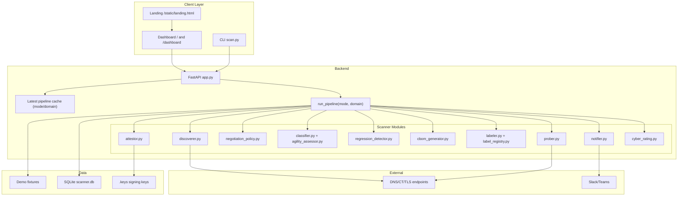

# Q-ARMOR Architecture (March 2026)

## Overview

Q-ARMOR is a mode-aware PQC assessment platform with a unified backend pipeline that supports both demo and live scans.

- Presentation: landing page and dashboard (`frontend/landing.html`, `frontend/index.html`)
- API layer: FastAPI app with static mounting and dashboard alias routes (`backend/app.py`)
- Pipeline layer: single orchestration flow for demo/live execution (`backend/pipeline.py`)
- Scanner layer: discovery, probing, negotiation analysis, classification, regression, labeling, attestation
- Persistence: SQLite (`data/scanner.db`) plus in-memory latest result cache

## Architecture Diagram

## Runtime Flow

1. Client calls mode-aware API (`mode=demo|live`, optional `domain`).
2. Backend checks cached pipeline context.
3. On cache miss/refresh, backend executes unified pipeline.
4. Pipeline returns a single `PipelineResult` payload (assets, heatmap, rating, CBOM, labels, attestation, alerts).
5. UI widgets and report endpoints derive their data from the latest pipeline result.
