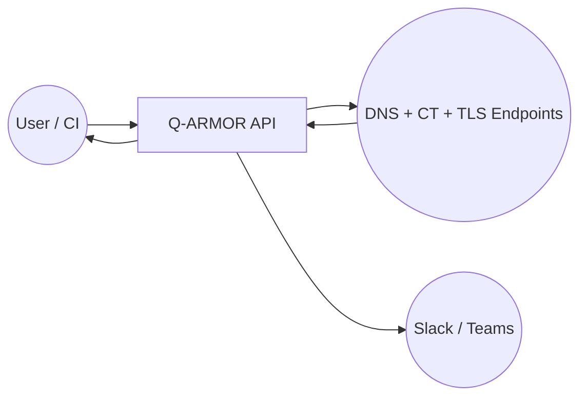
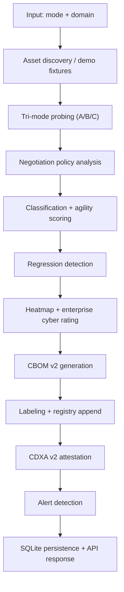
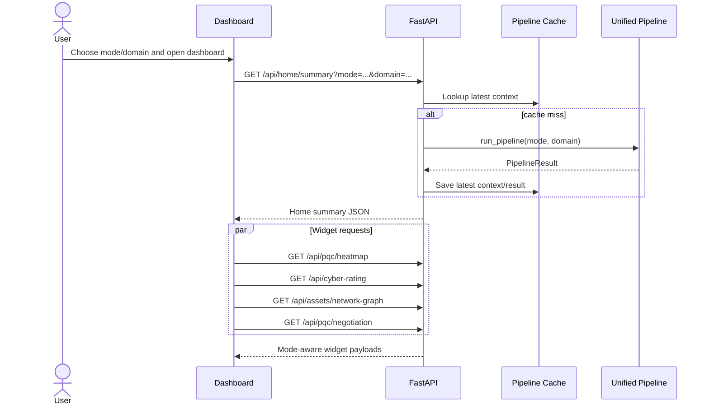
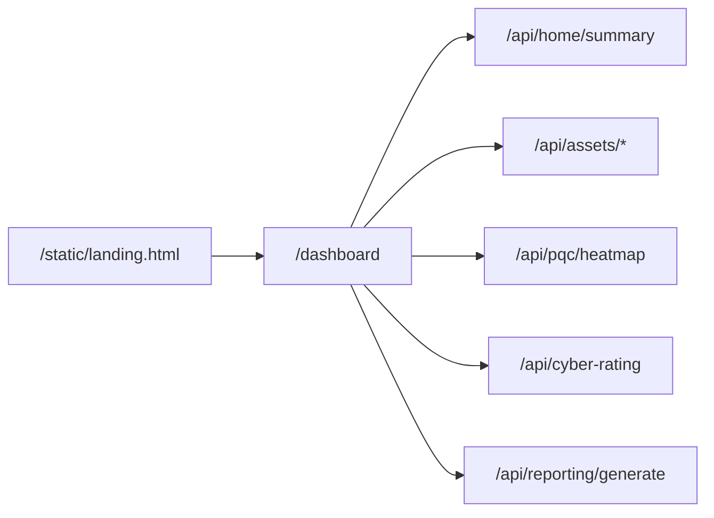

# Q-ARMOR Diagrams (March 2026)

## DFD Level 0

```mermaid
graph LR
    User(("User / CI")) --> API["Q-ARMOR API"]
    API --> Targets(("DNS + CT + TLS Endpoints"))
    Targets --> API
    API --> User
    API --> Webhooks(("Slack / Teams"))
```

## Unified Pipeline Flow

```mermaid
graph TD
    A["Input: mode + domain"] --> B["Asset discovery / demo fixtures"]
    B --> C["Tri-mode probing (A/B/C)"]
    C --> D["Negotiation policy analysis"]
    D --> E["Classification + agility scoring"]
    E --> F["Regression detection"]
    F --> G["Heatmap + enterprise cyber rating"]
    G --> H["CBOM v2 generation"]
    H --> I["Labeling + registry append"]
    I --> J["CDXA v2 attestation"]
    J --> K["Alert detection"]
    K --> L["SQLite persistence + API response"]
```

## Dashboard Sequence

```mermaid
sequenceDiagram
    actor User
    participant UI as Dashboard
    participant API as FastAPI
    participant Cache as Pipeline Cache
    participant Pipeline as Unified Pipeline

    User->>UI: Choose mode/domain and open dashboard
    UI->>API: GET /api/home/summary?mode=...&domain=...
    API->>Cache: Lookup latest context
    alt cache miss
      API->>Pipeline: run_pipeline(mode, domain)
      Pipeline-->>API: PipelineResult
      API->>Cache: Save latest context/result
    end
    API-->>UI: Home summary JSON

    par Widget requests
      UI->>API: GET /api/pqc/heatmap
      UI->>API: GET /api/cyber-rating
      UI->>API: GET /api/assets/network-graph
      UI->>API: GET /api/pqc/negotiation
    end
    API-->>UI: Mode-aware widget payloads
```

## Frontend Surface Map

```mermaid
graph LR
    Landing["/static/landing.html"] --> Dashboard["/dashboard"]
    Dashboard --> Summary["/api/home/summary"]
    Dashboard --> Assets["/api/assets/*"]
    Dashboard --> Heatmap["/api/pqc/heatmap"]
    Dashboard --> Rating["/api/cyber-rating"]
    Dashboard --> Reports["/api/reporting/generate"]
```
